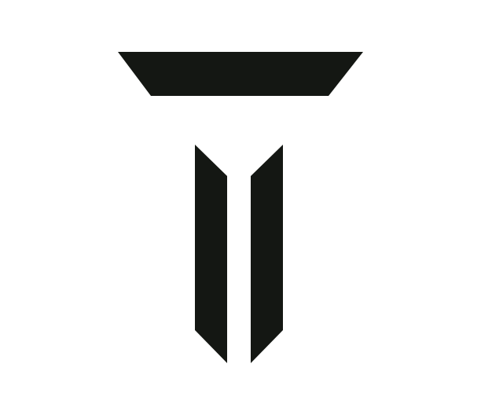
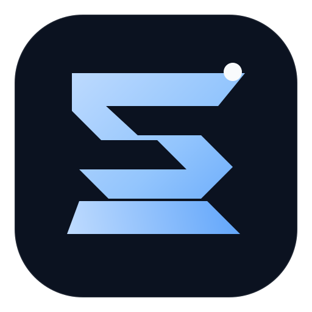

My long-term mission is to build a **native AI operating system and hardware platform** with **Obscure OS** — designed from the system layer up, rather than as a web interface made to look like an operating system.

I work across operating systems and native runtimes, AI agents and orchestration, cloud and network infrastructure, Linux and containers, deployment systems, browser and computer control, security and fraud research, and product/interface design.

I like working across the full stack of the system — from networks, infrastructure, runtimes and devices to the experience people actually use.

**Current work**

 [Obscure OS](https://github.com/jonahobiutom/Obscure-OS) ·  [Kivren](https://kivren.ai) ·  [Tervaq Cloud](https://apps.tervaq.com) ·  [SalesIQ](https://www.salesiq.tervaq.com) ·  [TrustLock](https://trustlock.direct)

[Website](https://jonahobiutom.com) · [Tervaq](https://tervaq.com) · [X](https://x.com/JonahObiutom) · [LinkedIn](https://linkedin.com/in/jonahobiutom)
